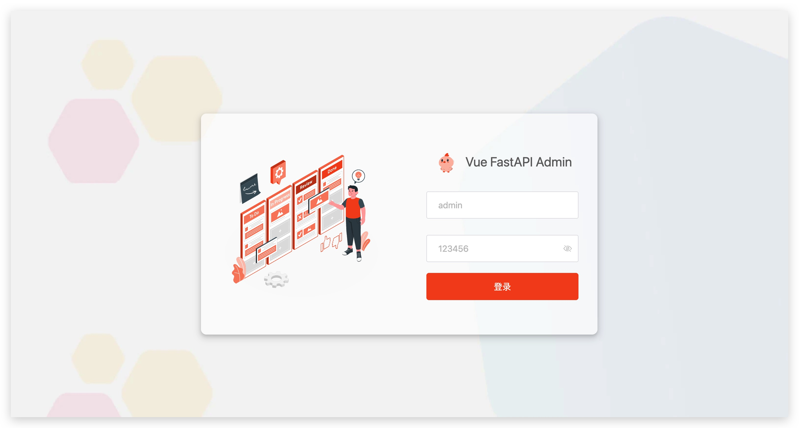
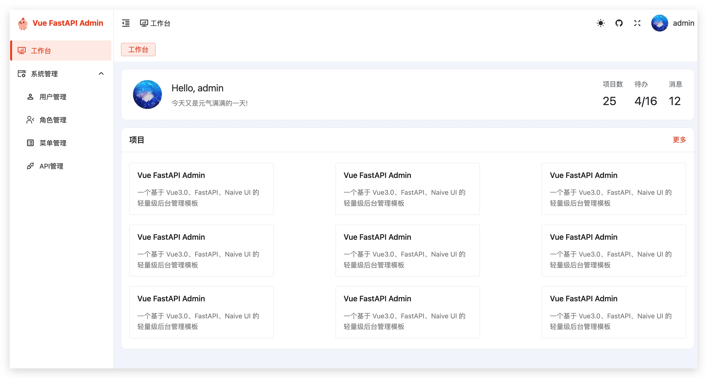
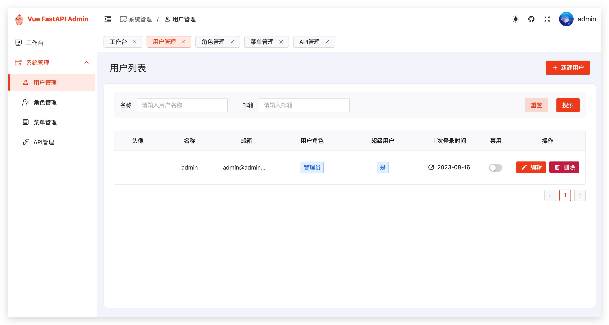
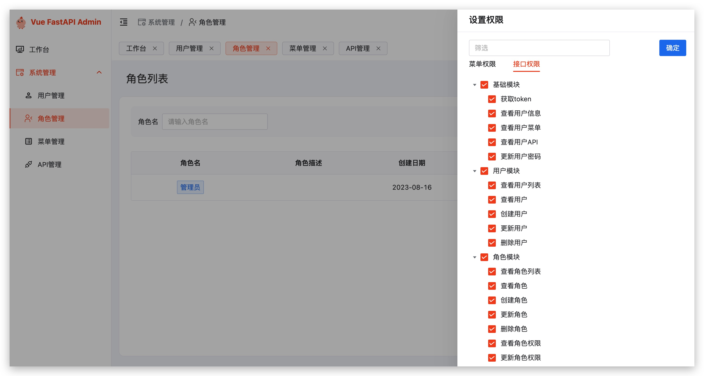
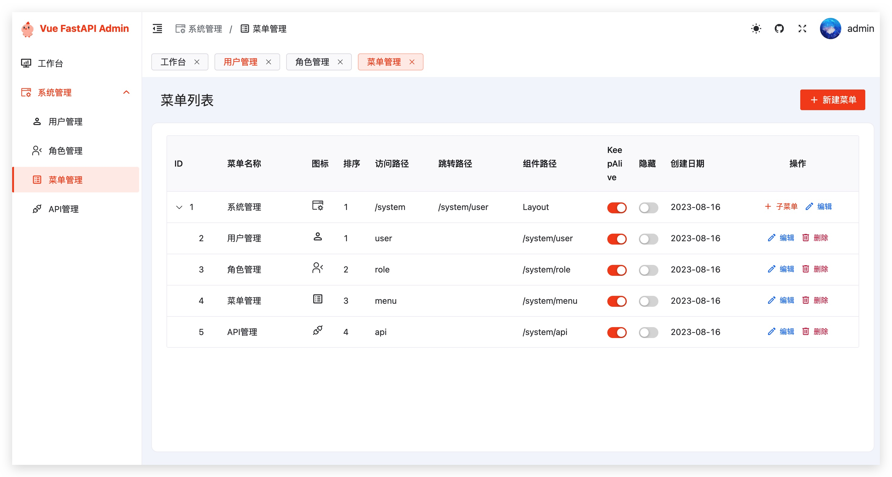
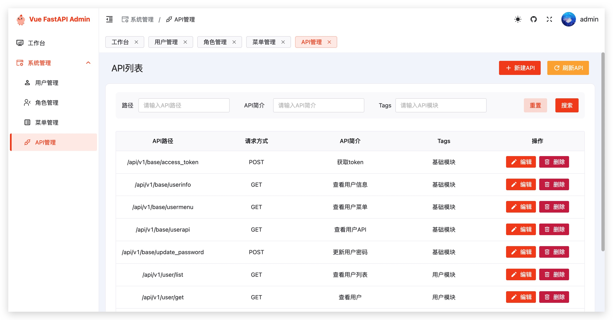

<p align="center">
  <a href="#">
    
  </a>
</p>

<h1 align="center">Super Intelligent Customer Service</h1>

English | [简体中文](README.md)

Super Intelligent Customer Service is a modern front-end and back-end separation development platform that combines FastAPI, Vue3, and Naive UI. It incorporates RBAC (Role-Based Access Control) management, dynamic routing, and JWT (JSON Web Token) authentication, providing comprehensive intelligent customer service solutions for enterprises.

### Features
- **Popular Tech Stack**: The backend is developed with the high-performance asynchronous framework FastAPI using Python 3.11, while the front-end is powered by cutting-edge technologies such as Vue3 and Vite, complemented by the efficient package manager, pnpm.
- **Code Standards**: The project is equipped with various plugins for code standardization and quality control, ensuring consistency and enhancing team collaboration efficiency.
- **Dynamic Routing**: Backend dynamic routing combined with the RBAC model allows for fine-grained control of menus and routing.
- **JWT Authentication**: User identity verification and authorization are handled through JWT, enhancing the application's security.
- **Granular Permission Control**: Implements detailed permission management including button and interface level controls, ensuring different roles and users have appropriate permissions.

### Live Demo
- URL: http://139.9.100.77:9999
- Username: admin
- Password: 123456

### Screenshots

#### Login Page


#### Workbench


#### User Management


#### Role Management


#### Menu Management


#### API Management


### Quick Start
Please follow the instructions below for installation and configuration:

#### Method 1：dockerhub pull image

```sh
docker pull mizhexiaoxiao/SuperIntelligentCustomerService:latest 
docker run -d --restart=always --name=SuperIntelligentCustomerService -p 9999:80 mizhexiaoxiao/SuperIntelligentCustomerService
```

#### Method 2: Build Image Using Dockerfile
##### Install Docker

```sh
yum install -y docker-ce
systemctl start docker
```

##### Build the Image

```sh
git clone https://github.com/mizhexiaoxiao/vue-fastapi-admin.git
cd SuperIntelligentCustomerService
docker build --no-cache . -t SuperIntelligentCustomerService
```

##### Start the Container

```sh
docker run -d --restart=always --name=SuperIntelligentCustomerService -p 9999:80 SuperIntelligentCustomerService
```

##### Access the Service

http://localhost:9999

username：admin

password：123456

### Local Setup
#### Backend
The backend service requires the following environment:
- Python 3.11

#### Method 1 (Recommended): Install Dependencies with uv
1. Install uv
```sh
pip install uv
```

2. Create and activate virtual environment
```sh
uv venv
source .venv/bin/activate  # Linux/Mac
# or
.\.venv\Scripts\activate  # Windows
```

3. Install dependencies
```sh
uv add pyproject.toml
```

4. Start the backend service
```sh
python run.py
```

#### Method 2: Install Dependencies with Pip
1. Create a Python virtual environment:
```sh
python3 -m venv venv
source venv/bin/activate  # Linux/Mac
# or
.\venv\Scripts\activate  # Windows
```

2. Install project dependencies:
```sh
pip install -r requirements.txt
```

3. Start the backend service:
```sh
python run.py
```
The backend service is now running, and you can visit http://localhost:9999/docs to view the API documentation.

#### Frontend
The frontend project requires a Node.js environment (recommended version 18.8.0 or higher).
- node v18.8.0+

1. Navigate to the frontend project directory:
```sh
cd admin_web
```

2. Install project dependencies (pnpm is recommended: https://pnpm.io/zh/installation)
```sh
npm i -g pnpm # If pnpm is already installed, skip this step
pnpm i # Or use npm i
```

3. Start the frontend development server:
```sh
pnpm dev
```

### Directory Structure Explanation

```
├── app                   // Application directory
│   ├── api               // API interface directory
│   │   └── v1            // Version 1 of the API interfaces
│   │       ├── apis      // API-related interfaces
│   │       ├── base      // Base information interfaces
│   │       ├── menus     // Menu related interfaces
│   │       ├── roles     // Role related interfaces
│   │       └── users     // User related interfaces
│   ├── controllers       // Controllers directory
│   ├── core              // Core functionality module
│   ├── log               // Log directory
│   ├── models            // Data models directory
│   ├── schemas           // Data schema/structure definitions
│   ├── settings          // Configuration settings directory
│   └── utils             // Utilities directory
├── deploy                // Deployment related directory
│   └── sample-picture    // Sample picture directory
└── web                   // Front-end web directory
    ├── build             // Build scripts and configuration directory
    │   ├── config        // Build configurations
    │   ├── plugin        // Build plugins
    │   └── script        // Build scripts
    ├── public            // Public resources directory
    │   └── resource      // Public resource files
    ├── settings          // Front-end project settings
    └── src               // Source code directory
        ├── api           // API interface definitions
        ├── assets        // Static resources directory
        │   ├── images    // Image resources
        │   ├── js        // JavaScript files
        │   └── svg       // SVG vector files
        ├── components    // Components directory
        │   ├── common    // Common components
        │   ├── icon      // Icon components
        │   ├── page      // Page components
        │   ├── query-bar // Query bar components
        │   └── table     // Table components
        ├── composables   // Composable functionalities
        ├── directives    // Directives directory
        ├── layout        // Layout directory
        │   └── components // Layout components
        ├── router        // Routing directory
        │   ├── guard     // Route guards
        │   └── routes    // Route definitions
        ├── store         // State management (pinia)
        │   └── modules   // State modules
        ├── styles        // Style files directory
        ├── utils         // Utilities directory
        │   ├── auth      // Authentication related utilities
        │   ├── common    // Common utilities
        │   ├── http      // Encapsulated axios
        │   └── storage   // Encapsulated localStorage and sessionStorage
        └── views         // Views/Pages directory
            ├── error-page // Error pages
            ├── login      // Login page
            ├── profile    // Profile page
            ├── system     // System management page
            └── workbench  // Workbench page
```

### Technical Support

If you encounter any issues while using the Super Intelligent Customer Service system, please feel free to submit an Issue or contact our technical support team.

We are committed to providing users with the highest quality intelligent customer service solutions.