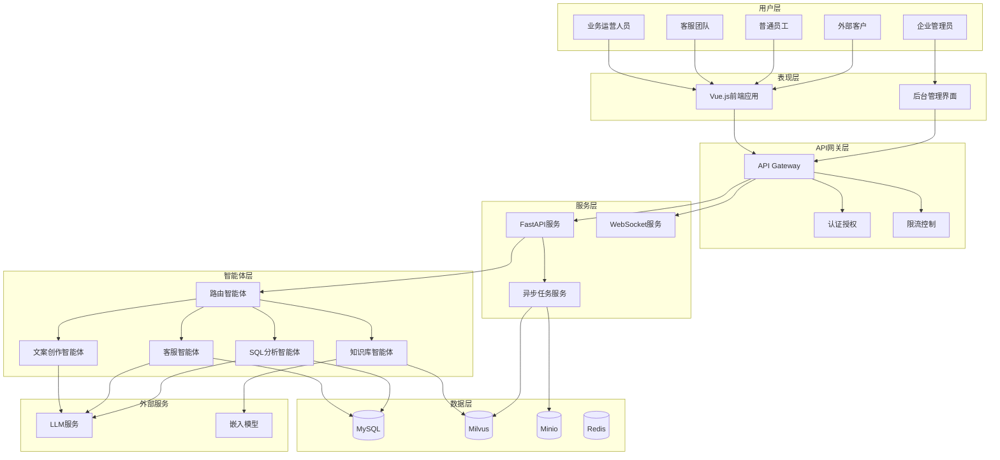
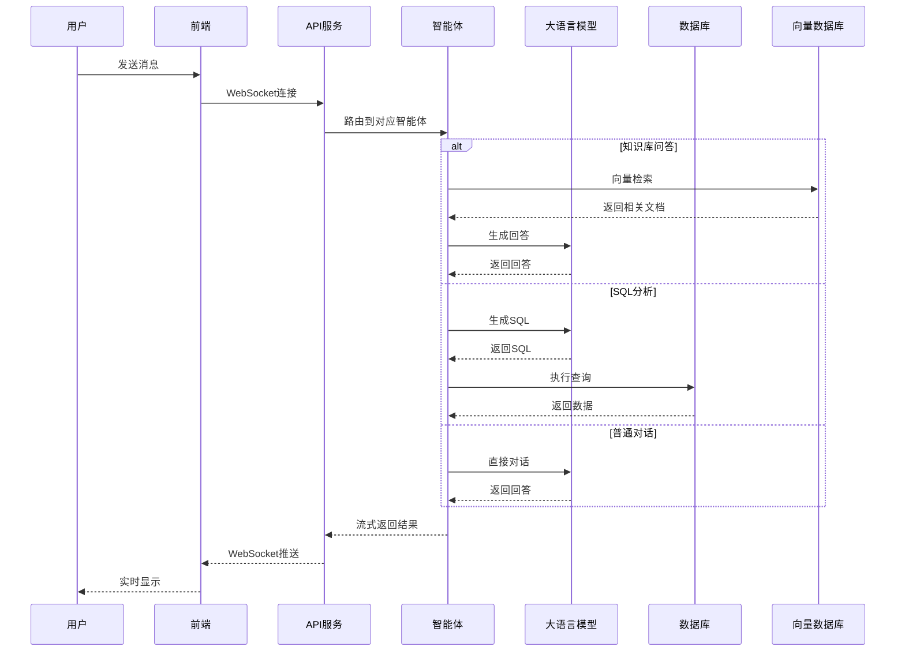

# 智能体应用综合平台 - 架构设计文档

## 1. 项目概述

### 1.1 项目愿景
打造一个集成了前沿AI技术、具备高度可扩展性和模块化能力的"一站式"智能体解决方案平台。

### 1.2 核心功能
- **智能客服智能体**: 流式对话、工具调用、会话管理
- **Text2SQL数据分析智能体**: 自然语言转SQL、数据可视化
- **企业知识库问答智能体**: RAG检索问答、来源引用
- **文案创作智能体**: 结构化创作、模板选择、多格式输出

## 2. 技术架构

### 2.1 四层架构模型

```
┌─────────────────────────────────────────────────────────┐
│                    表现层 (Presentation Layer)              │
│  Vue.js 3 + TypeScript + Vite + Element-Plus/Ant Design  │
│              WebSocket/SSE 流式对话支持                    │
└─────────────────────────────────────────────────────────┘
                              │
┌─────────────────────────────────────────────────────────┐
│                 服务与API层 (Service & API Layer)          │
│           Python 3.11+ + FastAPI + JWT认证               │
│              RESTful API + WebSocket/SSE                 │
└─────────────────────────────────────────────────────────┘
                              │
┌─────────────────────────────────────────────────────────┐
│              智能体与AI核心层 (Agent & AI Core Layer)        │
│    Autogen框架 + 多LLM集成 + Agent工作流 + RAG检索        │
└─────────────────────────────────────────────────────────┘
                              │
┌─────────────────────────────────────────────────────────┐
│              数据持久化层 (Data Persistence Layer)          │
│     MySQL 8.x + Milvus向量数据库 + Minio对象存储          │
└─────────────────────────────────────────────────────────┘
```

### 2.2 核心技术栈

**前端技术栈**:
- Vue.js 3 + Composition API
- TypeScript 4.9+
- Vite 4.x (构建工具)
- Element-Plus / Ant Design Vue (UI组件库)
- Vue Router 4 (路由管理)
- Pinia (状态管理)
- Axios (HTTP客户端)
- Socket.io-client (WebSocket客户端)

**后端技术栈**:
- Python 3.11+
- FastAPI (Web框架)
- SQLAlchemy 2.0 (ORM)
- Alembic (数据库迁移)
- Celery + Redis (异步任务队列)
- PyJWT (JWT认证)
- Uvicorn (ASGI服务器)
- Pydantic (数据验证)

**AI与智能体**:
- Autogen (智能体框架)
- OpenAI GPT-4o
- Google Gemini
- DeepSeek
- Langchain (LLM工具链)
- sentence-transformers (嵌入模型)

**数据存储**:
- MySQL 8.x (关系型数据库)
- Milvus 2.3+ (向量数据库)
- Minio (对象存储)
- Redis 7.x (缓存和消息队列)

**文件处理**:
- marker (PDF/DOCX转Markdown)
- PyMuPDF (PDF处理)
- python-docx (Word文档处理)
- Pillow (图像处理)

## 3. 系统架构图

### 3.1 整体架构图



### 3.2 数据流架构



## 4. 核心模块设计

### 4.1 智能体工作流设计

**路由智能体 (RouterAgent)**:
- 意图识别和分类
- 智能体选择和调度
- 上下文传递

**工具调用工作流**:
1. PlanningAgent: 任务规划和分解
2. ToolCallingAgent: 工具调用执行
3. SummarizingAgent: 结果整合和总结

**RAG问答工作流**:
1. QueryExpansionAgent: 查询扩展和改写
2. RetrieverAgent: 向量检索
3. RerankingAgent: 结果重排序
4. AnsweringAgent: 最终回答生成

### 4.2 RAG系统设计

**文件处理流程**:
```
文件上传 → Minio存储 → 任务队列 → Worker处理
    ↓
marker解析 → 语义分块 → 向量化 → Milvus存储
    ↓
状态更新 → 处理完成通知
```

**检索流程**:
```
用户查询 → 查询扩展 → 向量检索 → 重排序 → 答案生成
```

### 4.3 安全设计

**认证授权**:
- JWT Token认证
- RBAC权限控制
- API访问控制
- 数据隔离

**数据安全**:
- 敏感数据加密存储
- 传输层TLS加密
- 访问日志记录
- 数据备份策略

## 5. 部署架构

### 5.1 容器化部署

```yaml
# Docker Compose 架构
services:
  frontend:
    image: nginx:alpine
    ports: ["80:80"]
  
  backend:
    image: python:3.11-slim
    ports: ["8000:8000"]
    depends_on: [mysql, redis, milvus]
  
  mysql:
    image: mysql:8.0
    ports: ["3306:3306"]
  
  milvus:
    image: milvusdb/milvus:latest
    ports: ["19530:19530"]
  
  minio:
    image: minio/minio:latest
    ports: ["9000:9000"]
  
  redis:
    image: redis:7-alpine
    ports: ["6379:6379"]
```

### 5.2 扩展性设计

**水平扩展**:
- API服务无状态设计
- 负载均衡器分发
- 数据库读写分离
- 缓存集群

**垂直扩展**:
- 资源监控和自动扩容
- 性能瓶颈识别
- 组件独立扩展

## 6. 开发规范

### 6.1 代码规范
- Python: PEP 8 + Black格式化
- TypeScript: ESLint + Prettier
- Git提交规范: Conventional Commits

### 6.2 API设计规范
- RESTful API设计
- 统一响应格式
- 错误码标准化
- API版本管理

### 6.3 测试策略
- 单元测试覆盖率 > 80%
- 集成测试自动化
- 性能测试基准
- 安全测试检查

## 7. 项目目录结构

```
ai-agent-platform/
├── frontend/                    # Vue.js前端项目
│   ├── src/
│   │   ├── components/         # 通用组件
│   │   │   ├── common/        # 基础组件
│   │   │   ├── chat/          # 聊天相关组件
│   │   │   ├── forms/         # 表单组件
│   │   │   └── charts/        # 图表组件
│   │   ├── views/             # 页面组件
│   │   │   ├── auth/          # 认证页面
│   │   │   ├── agents/        # 智能体页面
│   │   │   ├── admin/         # 管理后台页面
│   │   │   └── dashboard/     # 仪表盘页面
│   │   ├── stores/            # Pinia状态管理
│   │   ├── router/            # 路由配置
│   │   ├── api/               # API接口封装
│   │   ├── utils/             # 工具函数
│   │   ├── types/             # TypeScript类型定义
│   │   └── assets/            # 静态资源
│   ├── public/
│   ├── package.json
│   └── vite.config.ts
├── backend/                     # FastAPI后端项目
│   ├── app/
│   │   ├── api/               # API路由
│   │   │   ├── v1/           # API版本1
│   │   │   │   ├── auth.py   # 认证接口
│   │   │   │   ├── users.py  # 用户管理
│   │   │   │   ├── agents.py # 智能体接口
│   │   │   │   ├── knowledge.py # 知识库接口
│   │   │   │   └── admin.py  # 管理接口
│   │   │   └── deps.py       # 依赖注入
│   │   ├── core/              # 核心配置
│   │   │   ├── config.py     # 配置管理
│   │   │   ├── security.py   # 安全相关
│   │   │   └── database.py   # 数据库配置
│   │   ├── models/            # 数据模型
│   │   │   ├── user.py       # 用户模型
│   │   │   ├── conversation.py # 会话模型
│   │   │   ├── knowledge.py  # 知识库模型
│   │   │   └── base.py       # 基础模型
│   │   ├── schemas/           # Pydantic模式
│   │   ├── services/          # 业务逻辑
│   │   │   ├── auth.py       # 认证服务
│   │   │   ├── user.py       # 用户服务
│   │   │   ├── knowledge.py  # 知识库服务
│   │   │   └── file.py       # 文件服务
│   │   ├── agents/            # 智能体实现
│   │   │   ├── base.py       # 基础智能体
│   │   │   ├── router.py     # 路由智能体
│   │   │   ├── customer_service.py # 客服智能体
│   │   │   ├── text2sql.py   # SQL分析智能体
│   │   │   ├── knowledge_qa.py # 知识库问答
│   │   │   └── content_creation.py # 文案创作
│   │   ├── utils/             # 工具函数
│   │   │   ├── file_processor.py # 文件处理
│   │   │   ├── vector_store.py # 向量存储
│   │   │   └── llm_client.py # LLM客户端
│   │   ├── tasks/             # 异步任务
│   │   │   ├── file_processing.py # 文件处理任务
│   │   │   └── vector_indexing.py # 向量索引任务
│   │   └── main.py            # 应用入口
│   ├── alembic/               # 数据库迁移
│   ├── tests/                 # 测试代码
│   │   ├── api/              # API测试
│   │   ├── services/         # 服务测试
│   │   └── agents/           # 智能体测试
│   ├── requirements.txt
│   └── Dockerfile
├── docs/                       # 项目文档
│   ├── architecture-design.md # 架构设计
│   ├── database-design.md     # 数据库设计
│   ├── api-specification.md   # API规范
│   └── deployment-guide.md    # 部署指南
├── docker/                     # Docker配置
│   ├── docker-compose.yml     # 开发环境
│   ├── docker-compose.prod.yml # 生产环境
│   └── nginx/                 # Nginx配置
├── scripts/                    # 部署脚本
│   ├── deploy.sh              # 部署脚本
│   ├── backup.sh              # 备份脚本
│   └── init-db.sh             # 数据库初始化
├── .github/                    # GitHub Actions
│   └── workflows/             # CI/CD工作流
├── task.md                     # 任务清单
├── todolist.md                 # 待办事项
└── README.md                   # 项目说明
```
