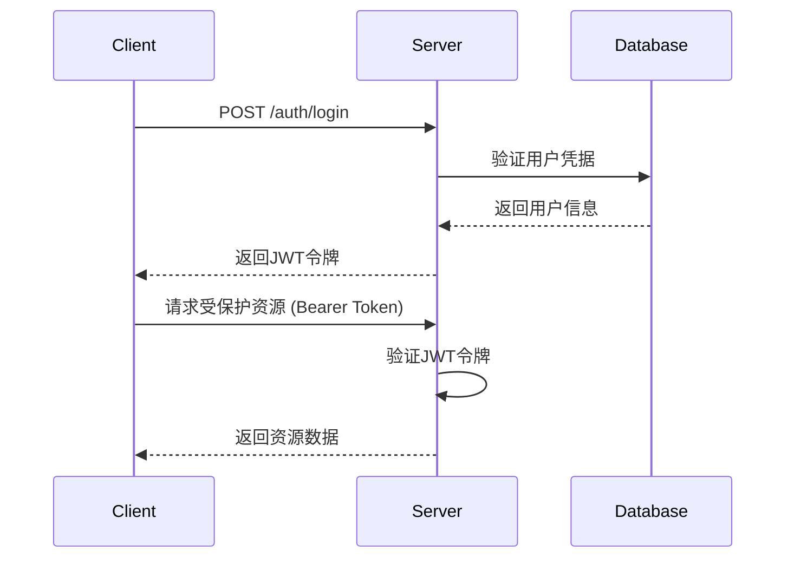

# 认证模块 API 文档

## 📋 模块概述

认证模块提供用户注册、登录、登出、令牌管理和密码管理等功能，基于JWT令牌实现无状态认证。

**基础路径**: `/api/v1/auth`

## 🔐 认证流程



## 📚 接口列表

### 1. 用户注册

**接口名称**: 用户注册  
**功能描述**: 创建新用户账户  
**接口地址**: `/api/v1/auth/register`  
**请求方式**: POST

#### 请求参数
```json
{
  "username": "testuser",
  "email": "test@example.com",
  "password": "password123",
  "confirm_password": "password123",
  "full_name": "测试用户",
  "phone": "13800138000"
}
```

| 参数名 | 类型 | 必填 | 说明 | 示例值 |
|-------|------|-----|------|--------|
| username | string | 是 | 用户名（3-50字符） | testuser |
| email | string | 是 | 邮箱地址 | test@example.com |
| password | string | 是 | 密码（8-128字符） | password123 |
| confirm_password | string | 是 | 确认密码 | password123 |
| full_name | string | 否 | 真实姓名 | 测试用户 |
| phone | string | 否 | 手机号码 | 13800138000 |

#### 响应参数
```json
{
  "id": 1,
  "username": "testuser",
  "email": "test@example.com",
  "full_name": "测试用户",
  "phone": "13800138000",
  "is_superuser": false,
  "is_staff": false,
  "status": "active",
  "created_at": "2024-01-01T12:00:00Z"
}
```

| 参数名 | 类型 | 说明 | 示例值 |
|-------|------|------|--------|
| id | int | 用户ID | 1 |
| username | string | 用户名 | testuser |
| email | string | 邮箱地址 | test@example.com |
| full_name | string | 真实姓名 | 测试用户 |
| phone | string | 手机号码 | 13800138000 |
| is_superuser | bool | 是否超级用户 | false |
| is_staff | bool | 是否员工 | false |
| status | string | 用户状态 | active |
| created_at | string | 创建时间 | 2024-01-01T12:00:00Z |

#### 错误码
- `400`: 用户名已存在 / 邮箱已存在 / 参数验证失败
- `500`: 服务器内部错误

---

### 2. 用户登录（表单格式）

**接口名称**: 用户登录  
**功能描述**: 使用用户名/邮箱和密码登录系统  
**接口地址**: `/api/v1/auth/login`  
**请求方式**: POST  
**Content-Type**: application/x-www-form-urlencoded

#### 请求参数
```
username=testuser&password=password123
```

| 参数名 | 类型 | 必填 | 说明 | 示例值 |
|-------|------|-----|------|--------|
| username | string | 是 | 用户名或邮箱 | testuser |
| password | string | 是 | 密码 | password123 |

#### 响应参数
```json
{
  "access_token": "eyJhbGciOiJIUzI1NiIsInR5cCI6IkpXVCJ9...",
  "token_type": "bearer",
  "expires_in": 3600,
  "user": {
    "id": 1,
    "username": "testuser",
    "email": "test@example.com",
    "full_name": "测试用户",
    "avatar_url": null,
    "is_superuser": false,
    "is_staff": false,
    "status": "active",
    "created_at": "2024-01-01T12:00:00Z",
    "last_login_at": "2024-01-01T12:30:00Z"
  }
}
```

| 参数名 | 类型 | 说明 | 示例值 |
|-------|------|------|--------|
| access_token | string | JWT访问令牌 | eyJhbGciOiJIUzI1NiIs... |
| token_type | string | 令牌类型 | bearer |
| expires_in | int | 过期时间（秒） | 3600 |
| user | object | 用户信息 | 见用户对象 |

#### 错误码
- `401`: 用户名或密码错误
- `403`: 账户未激活
- `423`: 账户已被锁定

---

### 3. 用户登录（JSON格式）

**接口名称**: JSON格式登录  
**功能描述**: 使用JSON格式进行用户登录  
**接口地址**: `/api/v1/auth/login/json`  
**请求方式**: POST

#### 请求参数
```json
{
  "username": "testuser",
  "password": "password123",
  "remember_me": false
}
```

| 参数名 | 类型 | 必填 | 说明 | 示例值 |
|-------|------|-----|------|--------|
| username | string | 是 | 用户名或邮箱 | testuser |
| password | string | 是 | 密码 | password123 |
| remember_me | bool | 否 | 记住登录状态 | false |

#### 响应参数
与表单登录相同。

---

### 4. 用户登出

**接口名称**: 用户登出  
**功能描述**: 用户退出登录  
**接口地址**: `/api/v1/auth/logout`  
**请求方式**: POST  
**认证**: 需要Bearer Token

#### 请求参数
无

#### 响应参数
```json
{
  "message": "登出成功"
}
```

---

### 5. 获取当前用户信息

**接口名称**: 获取当前用户信息  
**功能描述**: 获取当前登录用户的详细信息  
**接口地址**: `/api/v1/auth/me`  
**请求方式**: GET  
**认证**: 需要Bearer Token

#### 请求参数
无

#### 响应参数
```json
{
  "id": 1,
  "username": "testuser",
  "email": "test@example.com",
  "full_name": "测试用户",
  "avatar_url": null,
  "bio": null,
  "phone": "13800138000",
  "is_email_verified": false,
  "is_phone_verified": false,
  "is_superuser": false,
  "is_staff": false,
  "status": "active",
  "language": "zh",
  "timezone": "Asia/Shanghai",
  "theme": "light",
  "created_at": "2024-01-01T12:00:00Z",
  "updated_at": "2024-01-01T12:00:00Z",
  "last_login_at": "2024-01-01T12:30:00Z",
  "login_count": 5
}
```

---

### 6. 刷新令牌

**接口名称**: 刷新访问令牌  
**功能描述**: 使用当前令牌获取新的访问令牌  
**接口地址**: `/api/v1/auth/refresh`  
**请求方式**: POST  
**认证**: 需要Bearer Token

#### 请求参数
无

#### 响应参数
```json
{
  "access_token": "eyJhbGciOiJIUzI1NiIsInR5cCI6IkpXVCJ9...",
  "token_type": "bearer",
  "expires_in": 3600,
  "user": {
    "id": 1,
    "username": "testuser",
    "email": "test@example.com"
  }
}
```

---

### 7. 修改密码

**接口名称**: 修改密码  
**功能描述**: 修改当前用户密码  
**接口地址**: `/api/v1/auth/change-password`  
**请求方式**: POST  
**认证**: 需要Bearer Token

#### 请求参数
```json
{
  "old_password": "oldpassword123",
  "new_password": "newpassword123"
}
```

| 参数名 | 类型 | 必填 | 说明 | 示例值 |
|-------|------|-----|------|--------|
| old_password | string | 是 | 原密码 | oldpassword123 |
| new_password | string | 是 | 新密码 | newpassword123 |

#### 响应参数
```json
{
  "message": "密码修改成功"
}
```

#### 错误码
- `400`: 原密码错误

---

### 8. 忘记密码

**接口名称**: 忘记密码  
**功能描述**: 发送密码重置邮件  
**接口地址**: `/api/v1/auth/forgot-password`  
**请求方式**: POST

#### 请求参数
```json
{
  "email": "test@example.com"
}
```

| 参数名 | 类型 | 必填 | 说明 | 示例值 |
|-------|------|-----|------|--------|
| email | string | 是 | 邮箱地址 | test@example.com |

#### 响应参数
```json
{
  "message": "如果邮箱存在，重置链接已发送"
}
```

---

### 9. 重置密码

**接口名称**: 重置密码  
**功能描述**: 使用重置令牌重置密码  
**接口地址**: `/api/v1/auth/reset-password`  
**请求方式**: POST

#### 请求参数
```json
{
  "token": "reset_token_here",
  "new_password": "newpassword123"
}
```

| 参数名 | 类型 | 必填 | 说明 | 示例值 |
|-------|------|-----|------|--------|
| token | string | 是 | 重置令牌 | reset_token_here |
| new_password | string | 是 | 新密码 | newpassword123 |

#### 响应参数
```json
{
  "message": "密码重置成功"
}
```

## 🔧 使用示例

### 完整登录流程
```bash
# 1. 用户注册
curl -X POST "http://localhost:8000/api/v1/auth/register" \
  -H "Content-Type: application/json" \
  -d '{
    "username": "testuser",
    "email": "test@example.com",
    "password": "password123",
    "confirm_password": "password123",
    "full_name": "测试用户"
  }'

# 2. 用户登录
curl -X POST "http://localhost:8000/api/v1/auth/login/json" \
  -H "Content-Type: application/json" \
  -d '{
    "username": "testuser",
    "password": "password123"
  }'

# 3. 使用令牌访问受保护资源
curl -X GET "http://localhost:8000/api/v1/auth/me" \
  -H "Authorization: Bearer YOUR_ACCESS_TOKEN"

# 4. 刷新令牌
curl -X POST "http://localhost:8000/api/v1/auth/refresh" \
  -H "Authorization: Bearer YOUR_ACCESS_TOKEN"

# 5. 用户登出
curl -X POST "http://localhost:8000/api/v1/auth/logout" \
  -H "Authorization: Bearer YOUR_ACCESS_TOKEN"
```

## 🚨 注意事项

1. **令牌安全**: JWT令牌包含敏感信息，请妥善保管
2. **令牌过期**: 默认过期时间为60分钟，请及时刷新
3. **密码强度**: 建议使用8位以上包含字母数字的密码
4. **账户锁定**: 连续登录失败会导致账户临时锁定
5. **邮箱验证**: 注册后建议进行邮箱验证
