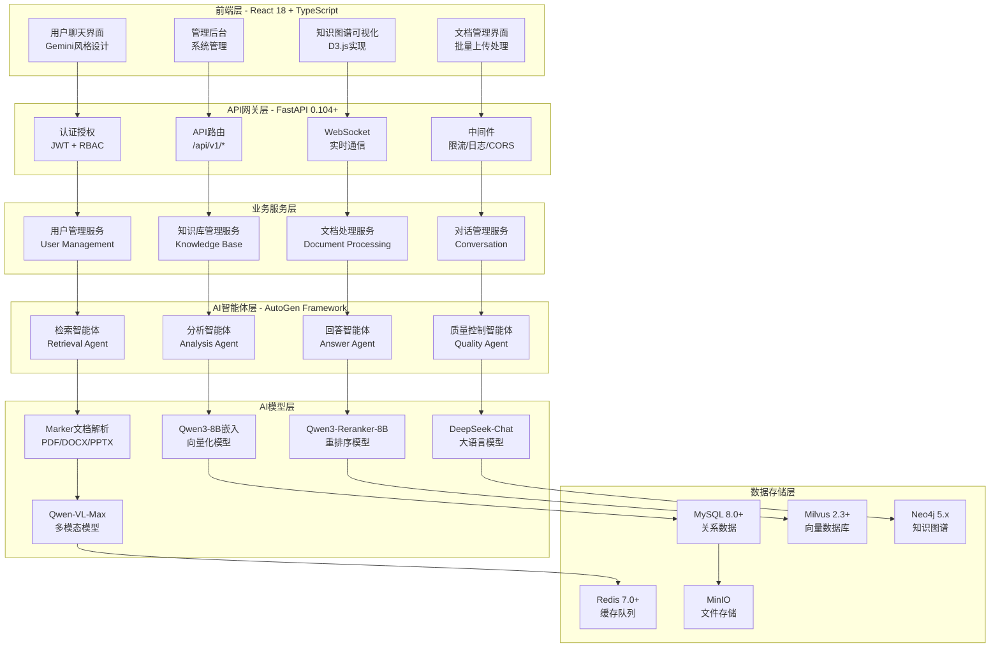
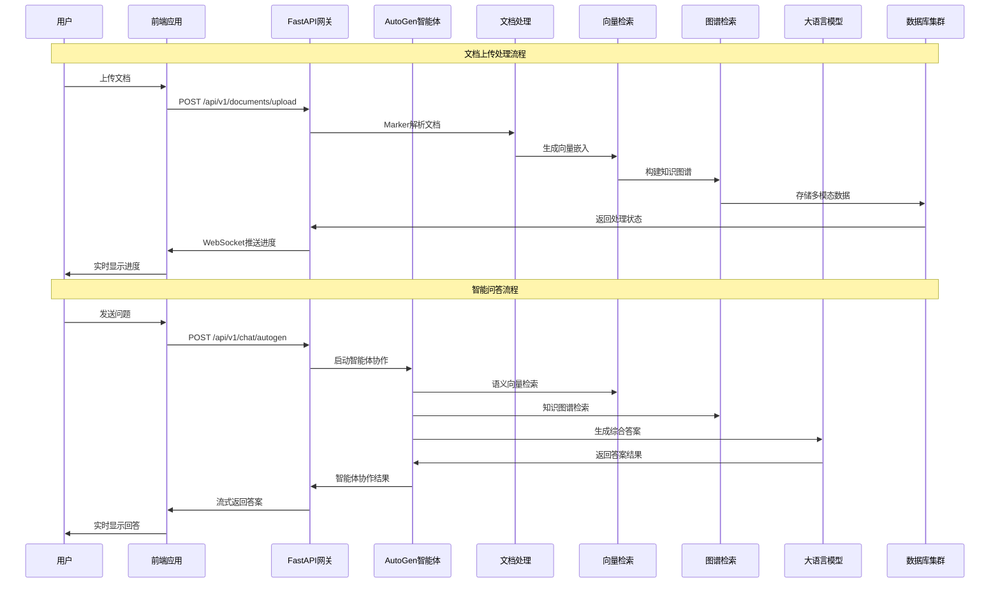
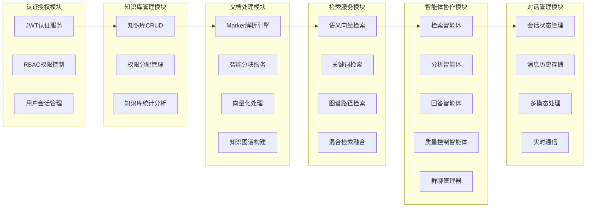
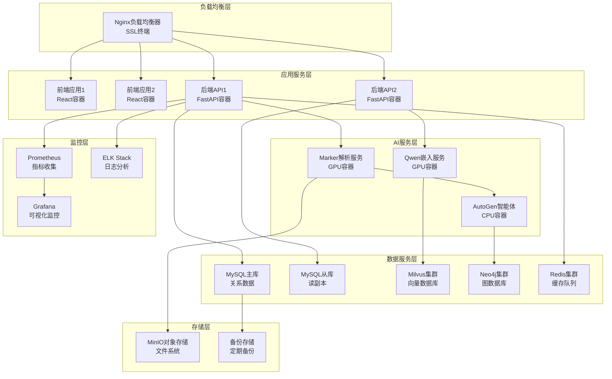

# 企业级RAG知识库系统架构设计文档

## 📋 系统概述

本系统是基于AutoGen多智能体协作的企业级RAG知识库系统，采用现代化微服务架构，集成Marker文档解析、Qwen3-8B嵌入模型、DeepSeek-chat LLM，提供完整的知识库管理和智能问答功能。

### 核心特性
- **多智能体协作**: 基于Microsoft AutoGen框架的智能体系统
- **混合检索**: 语义检索 + 关键词检索 + 知识图谱检索
- **高质量文档解析**: 基于Marker框架的多格式文档处理
- **仿Gemini界面**: 现代化的用户交互体验
- **企业级安全**: 完整的认证授权和权限控制

## 🏗️ 整体技术架构图

## 🔄 数据流架构图

## 🏛️ 微服务模块图

## 🚀 部署架构图

## 📊 技术栈详细说明

### 前端技术栈
- **核心框架**: React 18.2+ + TypeScript 5.0+ + Next.js 14+
- **构建工具**: Vite 4.0+ (快速构建和热重载)
- **UI组件库**: Ant Design 5.12+ (企业级组件)
- **状态管理**: Zustand 4.0+ (轻量级状态管理)
- **样式方案**: TailwindCSS 3.3+ + CSS Modules
- **可视化**: D3.js 7.0+ (知识图谱) + ECharts 5.4+ (统计图表)
- **网络层**: Axios 1.6+ + TanStack Query 4.0+ (数据获取)
- **动画库**: Framer Motion 10.0+ (流畅动画效果)

### 后端技术栈
- **Web框架**: FastAPI 0.104+ + Pydantic 2.0+ (高性能API)
- **异步处理**: Celery 5.3+ + Redis 7.0+ (任务队列)
- **数据库ORM**: SQLAlchemy 2.0+ + Alembic (数据库操作)
- **认证系统**: JWT + OAuth2 + RBAC (安全认证)
- **日志系统**: Loguru + ELK Stack (日志管理)
- **监控系统**: Prometheus + Grafana (性能监控)

### AI技术栈
- **智能体框架**: Microsoft AutoGen 0.2.18+ (多智能体协作)
- **文档解析**: Marker 0.2.15+ (高质量PDF解析)
- **嵌入模型**: Qwen3-8B (ModelScope部署)
- **重排序模型**: Qwen3-Reranker-8B (结果优化)
- **大语言模型**: DeepSeek-Chat API (主要对话模型)
- **多模态模型**: Qwen-VL-Max (图像理解)

### 数据库技术栈
- **关系数据库**: MySQL 8.0+ (用户数据、系统配置)
- **向量数据库**: Milvus 2.3+ (语义检索、HNSW索引)
- **图数据库**: Neo4j 5.x (知识图谱、Cypher查询)
- **缓存数据库**: Redis 7.0+ (会话缓存、任务队列)
- **对象存储**: MinIO (文件存储、备份)

## 🔧 核心组件设计

### 1. AutoGen智能体协作系统
- **检索智能体**: 负责多源检索和结果评估
- **分析智能体**: 负责信息整合和关系分析
- **回答智能体**: 负责答案生成和格式化
- **质量控制智能体**: 负责答案验证和质量评估
- **群聊管理器**: 协调智能体间的协作流程

### 2. 混合检索系统
- **语义检索**: 基于Qwen3-8B的向量相似度搜索
- **关键词检索**: 基于BM25的传统文本检索
- **图谱检索**: 基于Neo4j的实体关系查询
- **结果融合**: 使用Qwen3-Reranker-8B重排序

### 3. 文档处理流水线
- **格式支持**: PDF、DOCX、PPTX、XLSX、MD、TXT
- **解析引擎**: Marker框架高质量解析
- **智能分块**: 语义感知的文档分块
- **向量化**: Qwen3-8B生成高质量嵌入
- **图谱构建**: 自动实体识别和关系抽取

### 4. 实时通信系统
- **WebSocket**: 支持实时消息推送
- **流式响应**: 大语言模型流式输出
- **进度追踪**: 文档处理进度实时更新
- **错误处理**: 完善的异常处理机制

## 📈 性能指标与优化

### 系统性能目标
- **API响应时间**: < 2秒 (95%请求)
- **文档处理速度**: < 30秒/MB
- **并发用户数**: 1000+ 同时在线
- **检索准确率**: > 90% (Top-5)
- **系统可用性**: 99.9% 年度可用性

### 优化策略
- **缓存策略**: Redis多层缓存
- **数据库优化**: 读写分离、索引优化
- **负载均衡**: Nginx反向代理
- **异步处理**: Celery任务队列
- **资源池化**: 数据库连接池

## 🔒 安全架构设计

### 认证授权
- **JWT Token**: 无状态认证机制
- **RBAC权限**: 基于角色的访问控制
- **API密钥**: 第三方服务认证
- **会话管理**: 安全的会话生命周期

### 数据安全
- **数据加密**: 敏感数据AES加密
- **传输安全**: HTTPS/WSS加密传输
- **访问控制**: 细粒度权限控制
- **审计日志**: 完整的操作审计

## 📝 接口设计规范

### RESTful API设计
- **统一前缀**: `/api/v1/`
- **HTTP方法**: GET/POST/PUT/DELETE
- **状态码**: 标准HTTP状态码
- **响应格式**: 统一JSON格式

### WebSocket设计
- **连接管理**: 自动重连机制
- **消息格式**: JSON消息协议
- **心跳检测**: 定期连接检测
- **错误处理**: 优雅的错误处理

这个架构设计文档提供了系统的完整技术视图，为后续的开发和部署提供了详细的指导。所有组件都经过精心设计，确保系统的高性能、高可用性和可扩展性。
