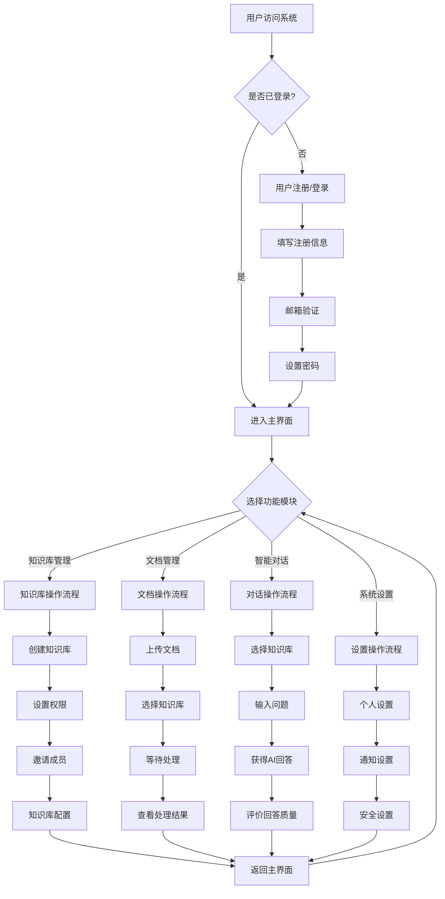
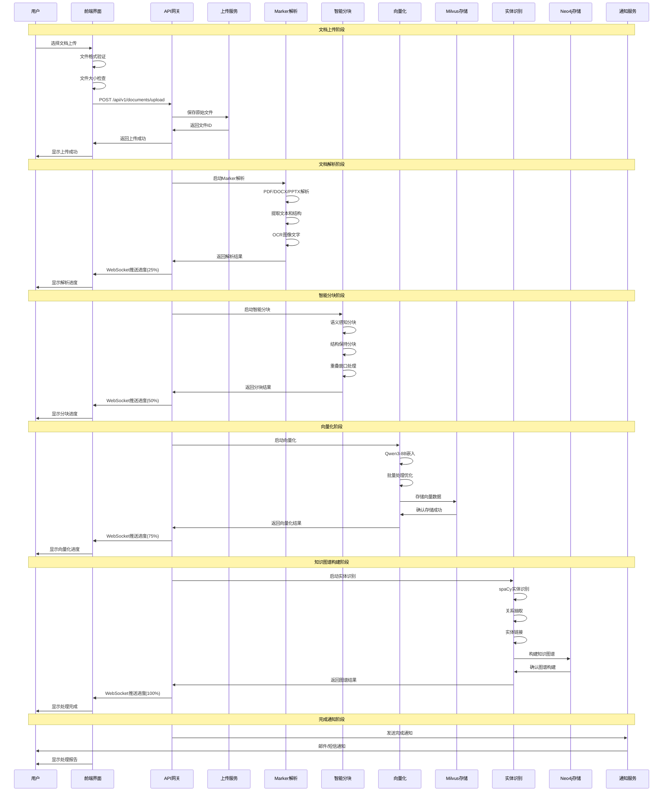
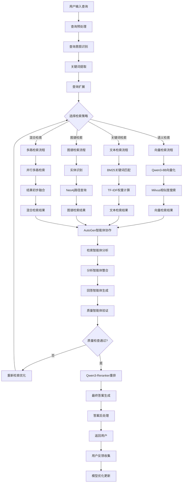
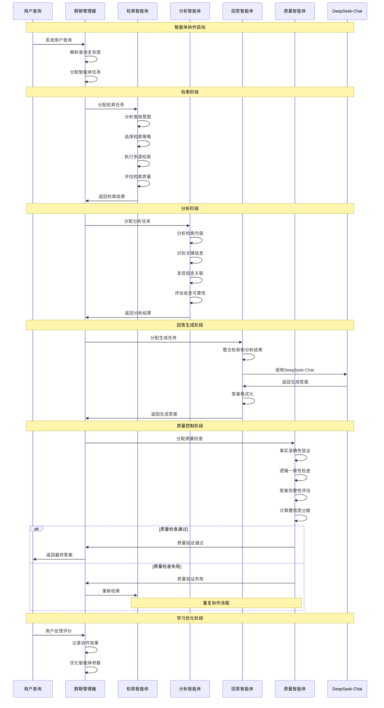
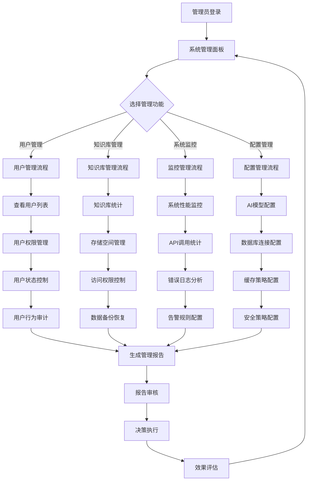
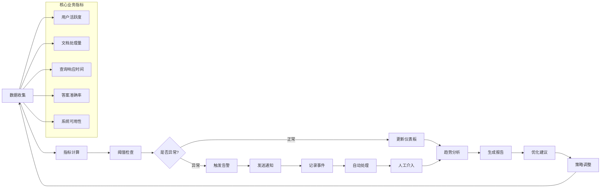
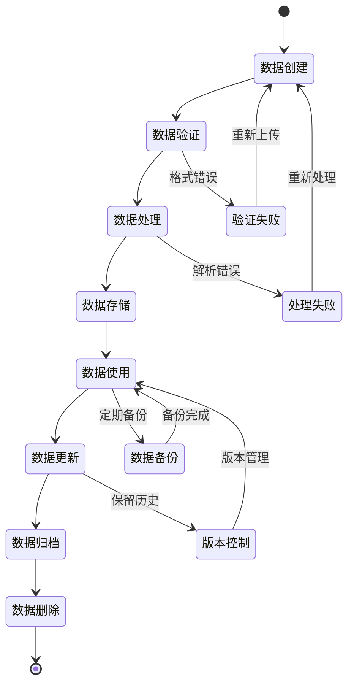

# 企业级RAG知识库系统业务流程设计文档

## 📋 业务流程概述

本文档详细描述了企业级RAG知识库系统的核心业务流程，包括用户操作流程、文档处理工作流、智能检索流程和系统管理流程。

## 👤 用户操作流程图

## 📄 文档处理工作流

## 🔍 智能检索流程

## 🤖 AutoGen多智能体协作流程

## 🛠️ 系统管理流程

## 📊 业务指标监控流程

## 🔄 数据生命周期管理

## 📈 业务流程优化策略

### 1. 用户体验优化
- **响应时间优化**: 目标2秒内响应
- **界面交互优化**: 流畅的动画和反馈
- **错误处理优化**: 友好的错误提示
- **个性化推荐**: 基于用户行为的智能推荐

### 2. 处理效率优化
- **批量处理**: 支持批量文档上传和处理
- **并行处理**: 多线程并行处理提升效率
- **缓存策略**: 多层缓存减少重复计算
- **资源调度**: 智能资源分配和负载均衡

### 3. 质量保证优化
- **多重验证**: 多智能体协作保证答案质量
- **持续学习**: 基于用户反馈持续优化
- **A/B测试**: 不同策略效果对比测试
- **质量监控**: 实时质量指标监控

### 4. 安全合规优化
- **数据加密**: 全链路数据加密保护
- **访问控制**: 细粒度权限控制
- **审计日志**: 完整的操作审计记录
- **合规检查**: 定期合规性检查和报告

这个业务流程设计文档详细描述了系统的各个业务流程，为系统的实施和运营提供了清晰的指导。所有流程都经过精心设计，确保系统的高效运行和优质的用户体验。
