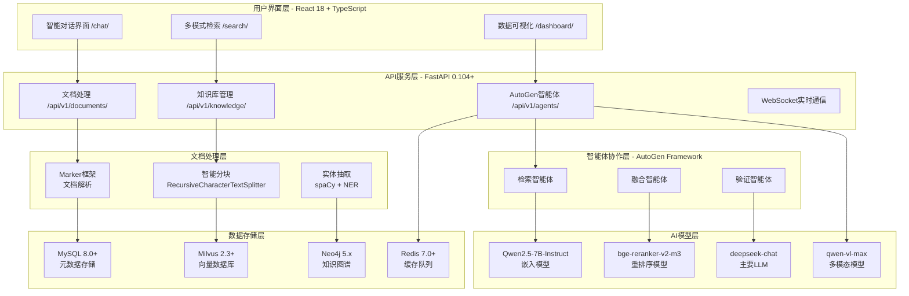
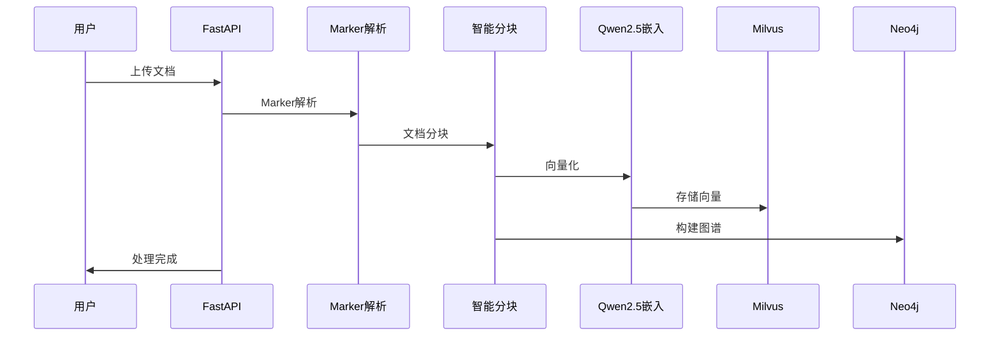
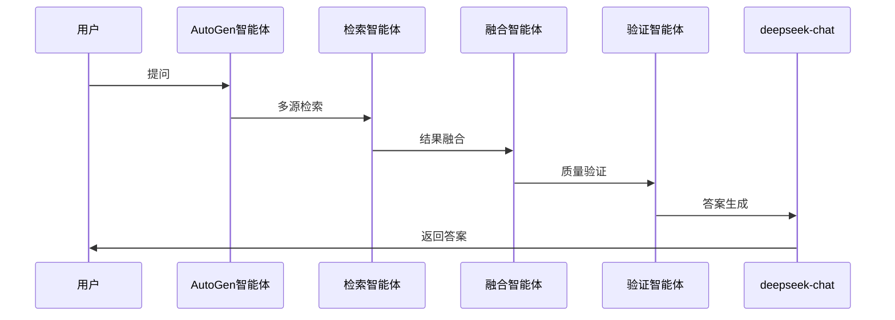

# 企业级RAG知识库系统技术架构设计 (重构版)

## 系统概述

本系统严格按照技术栈要求重构，是一个基于AutoGen智能体框架和多模态模型的企业级RAG知识库系统，集成Marker文档解析、Qwen嵌入模型、deepseek-chat LLM，提供完整的知识库管理和智能问答功能。

## 核心技术栈 (严格执行)

### 必需技术组件
- **智能体框架**: AutoGen (microsoft/autogen) - 多智能体协作和答案融合
- **关系数据库**: MySQL 8.0+ - 系统元数据、用户信息、会话记录
- **向量数据库**: Milvus 2.3+ - 语义检索和混合检索，HNSW索引
- **图数据库**: Neo4j 5.x - 知识图谱，Cypher查询
- **文档解析**: Marker (VikParuchuri/marker) - 多格式文档转Markdown
- **嵌入模型**: Qwen2.5-7B-Instruct (ModelScope部署)
- **重排序模型**: bge-reranker-v2-m3 (BAAI/bge-reranker-v2-m3)
- **主要LLM**: deepseek-chat API (模型热切换)
- **多模态模型**: qwen-vl-max (DashScope API，图像理解)

### 前端技术栈
- **核心框架**: React 18.2+ + TypeScript 5.0+ + Vite 4.0+
- **UI组件**: Ant Design 5.12+ (Table, Form, Modal, Drawer等企业组件)
- **状态管理**: Zustand 4.0+ (轻量级，支持持久化)
- **可视化**: D3.js 7.0+ (知识图谱) + ECharts 5.4+ (统计图表)
- **样式方案**: Tailwind CSS 3.3+ + CSS Modules
- **网络层**: Axios 1.6+ + TanStack Query 4.0+

### 后端技术栈
- **Web框架**: FastAPI 0.104+ + Pydantic 2.0+
- **异步处理**: Celery 5.3+ + Redis 7.0+
- **数据库ORM**: SQLAlchemy 2.0+ + Alembic
- **认证系统**: JWT + OAuth2 + RBAC
- **日志系统**: structlog + ELK Stack

## 系统架构图

## 核心功能模块

### 1. 文档处理模块 (/api/v1/documents/)
- **基于Marker框架**: 统一文档解析组件
- **支持格式**: PDF、DOCX、PPTX、XLSX、MD、TXT (最大100MB)
- **批量处理**: 最多50个文件，Celery异步队列
- **实时追踪**: WebSocket进度追踪和错误日志
- **去重机制**: MD5哈希去重和版本控制

### 2. 知识库处理流水线 (/api/v1/knowledge/)
- **处理流程**: 文档解析 → 智能分块 → Qwen2.5向量化 → Milvus存储
- **知识图谱**: spaCy + NER实体识别 → 关系抽取 → Neo4j存储
- **增量更新**: 仅处理变更文档，Git-like版本管理
- **质量检查**: 重复检测、语义一致性、图谱完整性

### 3. AutoGen智能体协作 (/api/v1/agents/)
- **检索智能体**: 多源检索专门负责
- **融合智能体**: 整合多个检索结果
- **验证智能体**: 事实核查和一致性验证
- **协作机制**: 消息传递、决策投票、冲突解决

## 数据流架构

### 文档处理流程

### 智能问答流程

## 性能优化策略

### 检索优化
- **语义检索**: Qwen2.5嵌入 + 余弦相似度 (top-k=20)
- **混合检索**: BM25 + 语义检索加权融合
- **图谱检索**: Neo4j Cypher查询 + 1-3跳关系推理
- **重排序**: bge-reranker-v2-m3重排序 + 相关性阈值过滤

### 缓存策略
- **Redis缓存**: 热点查询结果缓存
- **向量缓存**: 常用向量预加载
- **图谱缓存**: 频繁访问路径缓存

### 并发处理
- **异步处理**: Celery任务队列
- **连接池**: 数据库连接池优化
- **负载均衡**: 多实例部署支持

## 安全架构

### 认证授权
- **JWT认证**: 无状态token认证
- **OAuth2**: 第三方登录支持
- **RBAC**: 基于角色的权限控制

### 数据安全
- **传输加密**: HTTPS/WSS加密传输
- **存储加密**: 敏感数据加密存储
- **访问控制**: 细粒度权限控制

## 部署架构

### 容器化部署
- **Docker Compose**: 多服务编排
- **环境隔离**: 开发/测试/生产环境分离
- **配置管理**: 环境变量和配置文件管理

### 监控体系
- **健康检查**: /health/端点监控
- **性能指标**: Prometheus指标收集
- **日志聚合**: ELK Stack日志分析

## 技术决策说明

### 为什么选择这些技术？

1. **AutoGen**: 微软开源的多智能体框架，成熟稳定
2. **MySQL**: 企业级关系数据库，ACID特性保证数据一致性
3. **Milvus**: 专业向量数据库，HNSW索引性能优异
4. **Neo4j**: 图数据库领导者，Cypher查询语言强大
5. **Marker**: 高质量文档解析，支持复杂格式
6. **Qwen2.5**: 阿里云通义千问，中文理解能力强
7. **deepseek-chat**: 高性能LLM，支持长上下文
8. **React 18**: 现代前端框架，生态丰富

### 架构优势

1. **模块化设计**: 各组件独立，易于维护和扩展
2. **高性能**: 多级缓存和优化策略
3. **高可用**: 容器化部署和监控体系
4. **易扩展**: 微服务架构，水平扩展能力强
5. **企业级**: 完整的安全和权限控制

## 下一步实施计划

1. **第一阶段**: 技术栈重构和基础架构
2. **第二阶段**: 文档处理和知识库构建
3. **第三阶段**: AutoGen智能体协作系统
4. **第四阶段**: Gemini风格用户界面

详细实施计划请参考 `development-plan.md`。
