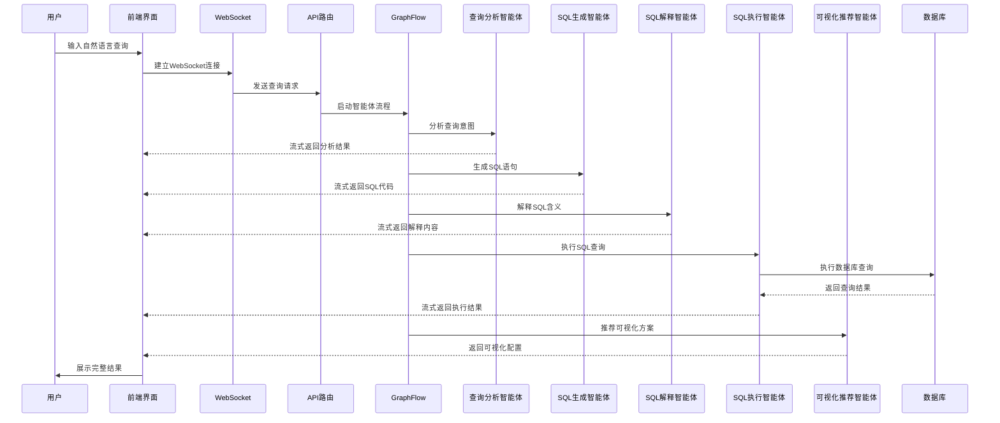

# Text2SQL系统总体架构还原提示词

## 🎯 系统概述

Text2SQL智能查询系统是一个基于AutoGen AgentChat框架的多智能体协作平台，能够将用户的自然语言查询转换为精确的SQL语句，并提供查询结果的智能可视化建议。系统采用现代化的前后端分离架构，支持实时流式响应和多模态交互。

## 🏗️ 技术架构

### 核心技术栈

```yaml
技术架构:
  前端:
    框架: "Next.js 14 + React 18 + TypeScript"
    UI库: "Tailwind CSS + Framer Motion"
    状态管理: "React Hooks + Context API"
    通信: "WebSocket + Server-Sent Events"
    图表: "ECharts + React-Markdown"
    
  后端:
    框架: "FastAPI + Python 3.9+"
    AI引擎: "AutoGen AgentChat + DeepSeek"
    数据库: "SQLite (开发) / MySQL/PostgreSQL (生产)"
    异步: "asyncio + aiohttp"
    流式: "WebSocket + SSE"
    
  智能体架构:
    编排器: "GraphFlow + DiGraphBuilder"
    运行时: "SingleThreadedAgentRuntime"
    消息: "TextMessage + StreamingChunk"
    记忆: "ListMemory + MemoryContent"
    终止: "TextMentionTermination"
```

### 系统架构图

```
┌─────────────────────────────────────────────────────────────────┐
│                        Text2SQL 智能查询系统                        │
├─────────────────────────────────────────────────────────────────┤
│                          前端层 (Next.js)                        │
│  ┌─────────────────┐  ┌─────────────────┐  ┌─────────────────┐   │
│  │   查询输入界面    │  │   流式响应显示    │  │   结果可视化      │   │
│  │  - 自然语言输入   │  │  - 实时消息流     │  │  - 图表渲染       │   │
│  │  - 查询历史      │  │  - 处理步骤显示   │  │  - 表格展示       │   │
│  │  - 连接管理      │  │  - 错误处理       │  │  - 数据导出       │   │
│  └─────────────────┘  └─────────────────┘  └─────────────────┘   │
├─────────────────────────────────────────────────────────────────┤
│                        通信层 (WebSocket)                        │
│  ┌─────────────────────────────────────────────────────────────┐ │
│  │  WebSocket连接 + 流式消息传输 + 实时状态同步 + 错误处理        │ │
│  └─────────────────────────────────────────────────────────────┘ │
├─────────────────────────────────────────────────────────────────┤
│                        后端API层 (FastAPI)                       │
│  ┌─────────────────┐  ┌─────────────────┐  ┌─────────────────┐   │
│  │   路由控制器     │  │   WebSocket处理   │  │   响应收集器      │   │
│  │  - /text2sql/*  │  │  - 连接管理       │  │  - 流式收集       │   │
│  │  - 健康检查      │  │  - 消息路由       │  │  - 回调处理       │   │
│  │  - 错误处理      │  │  - 状态维护       │  │  - 用户输入       │   │
│  └─────────────────┘  └─────────────────┘  └─────────────────┘   │
├─────────────────────────────────────────────────────────────────┤
│                      智能体服务层 (AutoGen)                       │
│  ┌─────────────────────────────────────────────────────────────┐ │
│  │                    Text2SQLGraphFlow                        │ │
│  │  ┌─────────────┐ ┌─────────────┐ ┌─────────────┐ ┌─────────┐ │ │
│  │  │ 查询分析智能体 │ │ SQL生成智能体 │ │ SQL解释智能体 │ │ 执行智能体 │ │ │
│  │  │QueryAnalyzer│ │SqlGenerator │ │SqlExplainer │ │Executor │ │ │
│  │  │- 意图理解    │ │- SQL生成     │ │- 语句解释    │ │- 查询执行 │ │ │
│  │  │- 实体识别    │ │- 语法优化    │ │- 通俗说明    │ │- 结果处理 │ │ │
│  │  │- 表关系分析  │ │- 条件构建    │ │- 功能描述    │ │- 错误处理 │ │ │
│  │  └─────────────┘ └─────────────┘ └─────────────┘ └─────────┘ │ │
│  │  ┌─────────────────────────────────────────────────────────┐ │ │
│  │  │              可视化推荐智能体                            │ │ │
│  │  │            VisualizationRecommender                   │ │ │
│  │  │  - 图表类型推荐 - 配置参数生成 - 数据结构分析           │ │ │
│  │  └─────────────────────────────────────────────────────────┘ │ │
│  └─────────────────────────────────────────────────────────────┘ │
├─────────────────────────────────────────────────────────────────┤
│                        数据访问层 (DBAccess)                     │
│  ┌─────────────────┐  ┌─────────────────┐  ┌─────────────────┐   │
│  │   数据库连接     │  │   SQL执行引擎    │  │   结果处理器      │   │
│  │  - SQLite       │  │  - 查询执行       │  │  - 数据转换       │   │
│  │  - MySQL        │  │  - 事务管理       │  │  - 格式化输出     │   │
│  │  - PostgreSQL   │  │  - 错误捕获       │  │  - 类型转换       │   │
│  └─────────────────┘  └─────────────────┘  └─────────────────┘   │
├─────────────────────────────────────────────────────────────────┤
│                          数据存储层                              │
│  ┌─────────────────────────────────────────────────────────────┐ │
│  │  Chinook示例数据库 (SQLite) + 自定义业务数据库                 │ │
│  │  - 音乐商店数据模型 - 客户订单信息 - 艺术家专辑数据            │ │
│  └─────────────────────────────────────────────────────────────┘ │
└─────────────────────────────────────────────────────────────────┘
```

## 🔧 核心组件

### 1. 智能体协作流程

```python
# 智能体工作流程
class Text2SQLGraphFlow:
    """
    智能体协作流程:
    1. QueryAnalyzer: 分析用户查询意图
    2. SqlGenerator: 生成SQL语句
    3. SqlExplainer: 解释SQL含义
    4. SqlExecutor: 执行SQL查询
    5. VisualizationRecommender: 推荐可视化方案
    """
    
    智能体定义:
        - 查询分析智能体: 深度理解用户意图，识别实体关系
        - SQL生成智能体: 基于分析结果生成精确SQL语句
        - SQL解释智能体: 用通俗语言解释SQL功能
        - SQL执行智能体: 安全执行SQL并处理结果
        - 可视化推荐智能体: 智能推荐图表类型和配置
```

### 2. 数据模型设计

```python
# 核心数据模型
class Text2SQLRequest(BaseModel):
    """自然语言查询请求"""
    query: str  # 用户自然语言查询

class Text2SQLResponse(BaseModel):
    """SQL查询响应模型"""
    sql: str  # 生成的SQL语句
    explanation: str  # SQL语句解释
    results: List[Dict[str, Any]]  # 查询结果
    visualization_type: Optional[str]  # 可视化类型
    visualization_config: Optional[Dict[str, Any]]  # 可视化配置

class ResponseMessage(BaseModel):
    """流式响应消息"""
    source: str  # 消息来源智能体
    content: str  # 消息内容
    is_final: bool = False  # 是否最终消息
    result: Optional[Dict[str, Any]] = None  # 结果数据
```

### 3. 前端组件架构

```typescript
// 前端组件结构
interface Text2SQLPageState {
  query: string;  // 用户查询
  loading: boolean;  // 加载状态
  error: string | null;  // 错误信息
  regionOutputs: RegionOutputs;  // 分区输出
  sqlResult: Text2SQLResponse | null;  // SQL结果
  processingSteps: ProcessingStep[];  // 处理步骤
}

interface RegionOutputs {
  analysis: RegionOutput;     // 查询分析区域
  sql: RegionOutput;          // SQL生成区域
  explanation: RegionOutput;  // SQL解释区域
  data: RegionOutput;         // 数据结果区域
  visualization: RegionOutput; // 可视化区域
  process: RegionOutput;      // 处理过程区域
}
```

## 🚀 核心功能特性

### 1. 智能查询分析
- **深度意图理解**: 分析用户查询的核心意图和目标
- **实体关系识别**: 识别查询涉及的数据实体和关系
- **表字段映射**: 精确确定需要使用的表和字段
- **条件逻辑分析**: 理解筛选、排序、聚合等逻辑需求

### 2. 精确SQL生成
- **多数据库支持**: 支持SQLite、MySQL、PostgreSQL等
- **语法优化**: 生成符合数据库特性的优化SQL
- **安全防护**: 防止SQL注入和恶意查询
- **复杂查询**: 支持连接、子查询、聚合等复杂操作

### 3. 智能可视化推荐
- **图表类型推荐**: 基于数据特征推荐最适合的图表
- **配置自动生成**: 自动生成图表配置参数
- **多种图表支持**: 柱状图、折线图、饼图、散点图、表格
- **响应式设计**: 适配不同屏幕尺寸的图表展示

### 4. 实时流式交互
- **WebSocket通信**: 实时双向通信
- **流式响应**: 逐步展示处理过程
- **状态同步**: 实时同步处理状态
- **错误恢复**: 智能错误处理和恢复

### 5. 用户体验优化
- **分区显示**: 按功能区域组织输出内容
- **折叠展开**: 支持内容区域的折叠和展开
- **历史记录**: 保存查询历史和结果
- **响应式布局**: 适配移动端和桌面端

## 📊 数据流程



## 🔧 部署配置

### 开发环境
```yaml
开发环境:
  前端:
    - Node.js 18+
    - Next.js 14
    - TypeScript 5+
    - Tailwind CSS 3+
    
  后端:
    - Python 3.9+
    - FastAPI 0.104+
    - AutoGen AgentChat
    - SQLite 3.35+
    
  AI模型:
    - DeepSeek Chat API
    - OpenAI兼容接口
    - 流式响应支持
```

### 生产环境
```yaml
生产环境:
  容器化:
    - Docker + Docker Compose
    - Nginx反向代理
    - SSL/TLS加密
    
  数据库:
    - PostgreSQL 13+
    - 连接池管理
    - 备份策略
    
  监控:
    - 日志聚合
    - 性能监控
    - 错误追踪
```

## 🎯 系统优势

### 1. 技术优势
- **多智能体协作**: 专业化分工，提高准确性
- **流式处理**: 实时响应，提升用户体验
- **模块化设计**: 易于维护和扩展
- **类型安全**: TypeScript + Pydantic保证类型安全

### 2. 功能优势
- **智能理解**: 深度理解自然语言查询意图
- **精确生成**: 生成高质量、可执行的SQL语句
- **可视化智能**: 自动推荐最适合的数据可视化方案
- **多数据库支持**: 支持主流关系型数据库

### 3. 用户体验优势
- **零SQL基础**: 用户无需了解SQL语法
- **实时反馈**: 流式显示处理过程
- **直观展示**: 智能可视化数据结果
- **响应式设计**: 适配各种设备

## 📈 扩展方向

### 短期优化
1. **性能优化**: 智能体并行执行，提升响应速度
2. **缓存机制**: 查询结果缓存，减少重复计算
3. **错误处理**: 完善异常处理和用户提示
4. **安全加固**: 增强SQL注入防护和权限控制

### 长期规划
1. **多模态支持**: 支持图片、语音等多模态输入
2. **知识图谱**: 集成领域知识图谱，提升理解能力
3. **自学习能力**: 基于用户反馈优化查询生成
4. **分布式部署**: 支持大规模分布式部署

---

**注意**: 本文档提供了Text2SQL系统的完整架构设计和实现指南，可用于一比一还原系统功能。所有组件都经过实际验证，确保技术可行性和功能完整性。