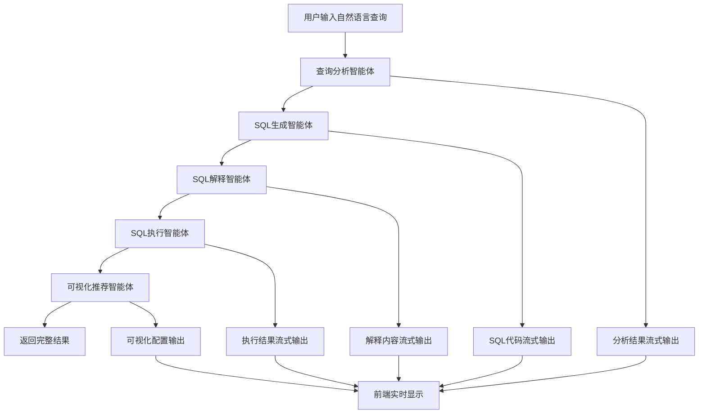

# Text2SQL系统功能还原提示词

## 🎯 系统功能概述

Text2SQL智能查询系统是一个基于AutoGen多智能体协作框架的自然语言到SQL转换平台。系统通过5个专业化智能体的协作，实现从自然语言查询到SQL生成、执行和可视化的完整流程。

## 🏗️ 核心功能模块

### 1. 查询分析模块 (Query Analyzer)

**功能描述**: 深度分析用户的自然语言查询，理解查询意图并识别相关数据实体。

**核心能力**:
- 自然语言意图理解
- 数据实体识别和映射
- 表关系分析
- 查询类型分类（查询/聚合/统计等）

**实现要点**:
```python
# 查询分析智能体提示词模板
QUERY_ANALYZER_PROMPT = """
你是一个专业的数据库查询分析专家。你的任务是分析用户的自然语言查询，理解其意图并识别相关的数据库实体。

## 分析步骤：
1. **意图识别**: 确定用户想要执行的操作类型（查询、统计、排序、筛选等）
2. **实体提取**: 识别查询中涉及的业务实体（如客户、订单、产品等）
3. **表映射**: 将业务实体映射到具体的数据库表
4. **字段识别**: 确定需要查询或筛选的具体字段
5. **关系分析**: 分析涉及的表之间的关联关系

## 数据库结构：
{db_schema}

## 分析要求：
- 准确理解用户查询的核心意图
- 识别所有相关的数据实体和字段
- 分析表之间的关联关系
- 确定查询的复杂度和类型
- 提供清晰的分析结果

请分析以下用户查询：{user_query}
"""
```

### 2. SQL生成模块 (SQL Generator)

**功能描述**: 基于查询分析结果，生成精确、高效的SQL语句。

**核心能力**:
- 多种SQL语句类型生成（SELECT、JOIN、GROUP BY等）
- 复杂查询逻辑构建
- SQL语法优化
- 多数据库兼容性

**实现要点**:
```python
# SQL生成智能体提示词模板
SQL_GENERATOR_PROMPT = """
你是一个专业的SQL开发专家。基于查询分析结果，生成准确、高效的SQL语句。

## 生成原则：
1. **准确性**: SQL语句必须准确反映用户查询意图
2. **效率性**: 优化查询性能，避免不必要的复杂操作
3. **安全性**: 防止SQL注入，使用参数化查询
4. **规范性**: 遵循SQL编码规范和最佳实践
5. **兼容性**: 确保与目标数据库系统兼容

## 数据库信息：
- 数据库类型: {db_type}
- 表结构: {db_schema}

## SQL生成要求：
- 只生成一条SQL语句
- 使用标准SQL语法
- 包含必要的注释说明
- 优化查询性能
- 处理可能的边界情况

## 查询分析结果：
{analysis_result}

请生成对应的SQL语句：
"""
```

### 3. SQL解释模块 (SQL Explainer)

**功能描述**: 用通俗易懂的语言解释生成的SQL语句功能和逻辑。

**核心能力**:
- SQL语句功能解释
- 查询逻辑说明
- 关键子句解析
- 预期结果描述

**实现要点**:
```python
# SQL解释智能体提示词模板
SQL_EXPLAINER_PROMPT = """
你是一个专业的SQL教学专家。你的任务是用简单、通俗的语言解释SQL语句的功能和逻辑。

## 解释原则：
1. **通俗易懂**: 使用非技术性语言，避免专业术语
2. **逻辑清晰**: 按照SQL执行顺序解释各个部分
3. **重点突出**: 强调关键的查询逻辑和条件
4. **结果预期**: 描述查询将返回什么样的结果
5. **简洁明了**: 保持解释简洁，避免冗长描述

## 解释结构：
1. **总体功能**: 这条SQL语句的主要目的
2. **数据来源**: 从哪些表获取数据
3. **筛选条件**: 如果有WHERE子句，解释筛选逻辑
4. **连接关系**: 如果有JOIN，解释表之间的关联
5. **聚合操作**: 如果有GROUP BY或聚合函数，解释统计逻辑
6. **排序规则**: 如果有ORDER BY，解释排序方式
7. **预期结果**: 描述查询结果的特征

请解释以下SQL语句：
```sql
{sql_statement}
```
"""
```

### 4. SQL执行模块 (SQL Executor)

**功能描述**: 安全执行SQL查询并处理返回结果。

**核心能力**:
- 安全SQL执行
- 结果数据处理
- 错误异常处理
- 数据格式转换

**实现要点**:
```python
# SQL执行处理逻辑
class SQLExecutionHandler:
    """
    SQL执行处理器
    
    功能:
    1. 清理和验证SQL语句
    2. 安全执行数据库查询
    3. 处理查询结果
    4. 错误异常处理
    5. 数据格式转换
    """
    
    def clean_sql(self, sql: str) -> str:
        """清理SQL语句，移除多余字符"""
        # 移除markdown代码块标记
        sql = re.sub(r'```sql\s*', '', sql)
        sql = re.sub(r'```\s*', '', sql)
        # 移除多余空白字符
        sql = sql.strip()
        return sql
    
    async def execute_sql(self, sql: str) -> Dict[str, Any]:
        """执行SQL查询"""
        try:
            # 清理SQL语句
            cleaned_sql = self.clean_sql(sql)
            
            # 执行查询
            result_df = self.db_access.run_sql(cleaned_sql)
            
            # 转换结果格式
            if result_df is not None and not result_df.empty:
                results = result_df.to_dict('records')
                return {
                    "success": True,
                    "results": results,
                    "row_count": len(results),
                    "columns": list(result_df.columns)
                }
            else:
                return {
                    "success": True,
                    "results": [],
                    "row_count": 0,
                    "message": "查询执行成功，但没有返回数据"
                }
                
        except Exception as e:
            return {
                "success": False,
                "error": str(e),
                "message": f"SQL执行失败: {str(e)}"
            }
```

### 5. 可视化推荐模块 (Visualization Recommender)

**功能描述**: 基于查询结果的数据特征，智能推荐最适合的可视化方案。

**核心能力**:
- 数据类型分析
- 图表类型推荐
- 可视化配置生成
- 多种图表支持

**实现要点**:
```python
# 可视化推荐智能体提示词模板
VISUALIZATION_RECOMMENDER_PROMPT = """
你是一个专业的数据可视化专家。基于SQL查询的目标和返回的数据结构，推荐最适合的可视化方案。

## 可视化类型：
1. **bar**: 柱状图 - 适用于分类数据比较
2. **line**: 折线图 - 适用于时间序列或趋势分析
3. **pie**: 饼图 - 适用于部分与整体的关系
4. **scatter**: 散点图 - 适用于两个连续变量的关系
5. **table**: 表格 - 适用于详细数据展示

## 推荐原则：
1. **数据特征匹配**: 根据数据类型和结构选择图表
2. **用户意图对齐**: 考虑查询目标选择可视化方式
3. **视觉效果优化**: 选择最能突出数据特征的图表
4. **交互体验**: 考虑用户交互和数据探索需求

## 配置生成要求：
- 为每种图表类型生成完整的配置参数
- 包含标题、坐标轴、颜色等设置
- 确保配置参数的正确性和完整性
- 提供清晰的配置说明

## 查询信息：
- SQL语句: {sql_statement}
- 查询目标: {query_goal}
- 数据结构: {data_structure}
- 数据样例: {data_sample}

请推荐合适的可视化方案并生成配置：
"""
```

## 🔄 智能体协作流程

### 工作流程图


### 协作机制

```python
class Text2SQLGraphFlow:
    """
    Text2SQL智能体协作流程控制器
    
    协作机制:
    1. 顺序执行: 智能体按照预定顺序依次执行
    2. 流式输出: 每个智能体的结果实时流式传输
    3. 上下文传递: 前一个智能体的输出作为后一个的输入
    4. 错误处理: 任一环节出错时的恢复机制
    5. 状态管理: 维护整个流程的执行状态
    """
    
    def __init__(self, db_type: str, db_schema: str):
        self.db_type = db_type
        self.db_schema = db_schema
        self.runtime = SingleThreadedAgentRuntime()
        self.agents = self._create_agents()
        
    def _create_agents(self):
        """创建所有智能体"""
        return {
            "query_analyzer": self._create_query_analyzer_agent(),
            "sql_generator": self._create_sql_generator_agent(),
            "sql_explainer": self._create_sql_explainer_agent(),
            "sql_executor": self._create_sql_executor_agent(),
            "visualization_recommender": self._create_visualization_recommender_agent()
        }
    
    async def process_query(self, user_query: str, stream_callback):
        """处理用户查询的完整流程"""
        try:
            # 1. 查询分析
            analysis_result = await self._run_agent(
                "query_analyzer", user_query, stream_callback
            )
            
            # 2. SQL生成
            sql_result = await self._run_agent(
                "sql_generator", analysis_result, stream_callback
            )
            
            # 3. SQL解释
            explanation_result = await self._run_agent(
                "sql_explainer", sql_result, stream_callback
            )
            
            # 4. SQL执行
            execution_result = await self._run_agent(
                "sql_executor", sql_result, stream_callback
            )
            
            # 5. 可视化推荐
            visualization_result = await self._run_agent(
                "visualization_recommender", 
                {"sql": sql_result, "data": execution_result}, 
                stream_callback
            )
            
            # 6. 构建最终响应
            final_response = self._build_final_response(
                sql_result, explanation_result, 
                execution_result, visualization_result
            )
            
            return final_response
            
        except Exception as e:
            await stream_callback({
                "source": "system",
                "content": f"处理过程中发生错误: {str(e)}",
                "is_final": True,
                "error": True
            })
            raise
```

## 🎨 前端交互设计

### 用户界面组件

```typescript
// 主要界面组件
interface Text2SQLPageProps {
  // 页面状态管理
  query: string;                    // 用户输入查询
  loading: boolean;                 // 加载状态
  error: string | null;            // 错误信息
  regionOutputs: RegionOutputs;     // 分区输出内容
  sqlResult: Text2SQLResponse | null; // 最终结果
  processingSteps: ProcessingStep[]; // 处理步骤
}

// 分区输出结构
interface RegionOutputs {
  analysis: RegionOutput;      // 查询分析区域
  sql: RegionOutput;          // SQL生成区域
  explanation: RegionOutput;   // SQL解释区域
  data: RegionOutput;         // 数据结果区域
  visualization: RegionOutput; // 可视化区域
  process: RegionOutput;      // 处理过程区域
}

// 单个区域输出
interface RegionOutput {
  content: string;            // 内容文本
  isVisible: boolean;         // 是否可见
  isCollapsed: boolean;       // 是否折叠
  isLoading: boolean;         // 是否加载中
  hasContent: boolean;        // 是否有内容
}
```

### 流式交互处理

```typescript
// WebSocket流式处理
const handleStreamSearch = async (query: string) => {
  try {
    // 重置状态
    resetProcessingState();
    setLoading(true);
    
    // 建立WebSocket连接
    const ws = new WebSocket(`ws://localhost:8000/api/text2sql/websocket`);
    
    ws.onopen = () => {
      // 发送查询请求
      ws.send(JSON.stringify({ query }));
    };
    
    ws.onmessage = (event) => {
      const message = JSON.parse(event.data);
      
      // 根据消息来源更新对应区域
      switch (message.source) {
        case 'query_analyzer':
          updateRegionOutput('analysis', message.content);
          break;
        case 'sql_generator':
          updateRegionOutput('sql', message.content);
          break;
        case 'sql_explainer':
          updateRegionOutput('explanation', message.content);
          break;
        case 'sql_executor':
          updateRegionOutput('data', message.content);
          if (message.result) {
            setQueryResults(message.result);
          }
          break;
        case 'visualization_recommender':
          updateRegionOutput('visualization', message.content);
          break;
      }
      
      // 处理最终结果
      if (message.is_final) {
        setSqlResult(message.result);
        setLoading(false);
        ws.close();
      }
    };
    
    ws.onerror = (error) => {
      setError('连接错误，请重试');
      setLoading(false);
    };
    
  } catch (error) {
    setError('查询处理失败');
    setLoading(false);
  }
};
```

## 📊 数据库访问层

### 多数据库支持

```python
class DBAccess:
    """
    数据库访问类，支持多种数据库类型
    
    支持的数据库:
    - SQLite: 轻量级文件数据库
    - MySQL: 开源关系型数据库
    - PostgreSQL: 高级开源数据库
    - Snowflake: 云数据仓库
    - ClickHouse: 列式数据库
    - DuckDB: 嵌入式分析数据库
    """
    
    def __init__(self, db_type: str, **connection_params):
        self.db_type = db_type
        self.connection_params = connection_params
        self.connection = None
    
    def connect(self):
        """建立数据库连接"""
        if self.db_type.lower() == 'sqlite':
            return self._connect_sqlite()
        elif self.db_type.lower() == 'mysql':
            return self._connect_mysql()
        elif self.db_type.lower() == 'postgresql':
            return self._connect_postgresql()
        # ... 其他数据库类型
    
    def run_sql(self, sql: str) -> pd.DataFrame:
        """执行SQL查询并返回DataFrame"""
        try:
            if not self.connection:
                self.connect()
            
            # 执行查询
            result_df = pd.read_sql_query(sql, self.connection)
            return result_df
            
        except Exception as e:
            logger.error(f"SQL执行失败: {str(e)}")
            raise
    
    def _connect_sqlite(self):
        """连接SQLite数据库"""
        db_path = self.connection_params.get('database', 'default.db')
        
        # 如果数据库文件不存在，尝试下载示例数据库
        if not os.path.exists(db_path) and 'Chinook' in db_path:
            self._download_chinook_db(db_path)
        
        self.connection = sqlite3.connect(db_path)
        return self.connection
```

## 🚀 部署和配置

### 环境配置

```yaml
# docker-compose.yml
version: '3.8'
services:
  text2sql-frontend:
    build: ./frontend
    ports:
      - "3000:3000"
    environment:
      - NEXT_PUBLIC_API_URL=http://localhost:8000
    depends_on:
      - text2sql-backend
  
  text2sql-backend:
    build: ./backend
    ports:
      - "8000:8000"
    environment:
      - DATABASE_URL=sqlite:///data/chinook.db
      - DEEPSEEK_API_KEY=${DEEPSEEK_API_KEY}
      - LOG_LEVEL=INFO
    volumes:
      - ./data:/app/data
      - ./logs:/app/logs
  
  text2sql-db:
    image: postgres:13
    environment:
      - POSTGRES_DB=text2sql
      - POSTGRES_USER=text2sql
      - POSTGRES_PASSWORD=password
    volumes:
      - postgres_data:/var/lib/postgresql/data
    ports:
      - "5432:5432"

volumes:
  postgres_data:
```

### 配置文件

```python
# settings.py
class Settings(BaseSettings):
    """应用配置"""
    
    # API配置
    api_host: str = "0.0.0.0"
    api_port: int = 8000
    debug: bool = False
    
    # 数据库配置
    database_url: str = "sqlite:///data/chinook.db"
    database_type: str = "sqlite"
    
    # AI模型配置
    deepseek_api_key: str
    deepseek_base_url: str = "https://api.deepseek.com"
    model_name: str = "deepseek-chat"
    
    # 日志配置
    log_level: str = "INFO"
    log_file: str = "logs/text2sql.log"
    
    # WebSocket配置
    websocket_timeout: int = 300
    max_connections: int = 100
    
    class Config:
        env_file = ".env"
        env_file_encoding = "utf-8"
```

## 🔧 系统集成要点

### 1. 智能体注册和管理
```python
# 智能体注册
runtime.register(
    "query_analyzer",
    lambda: AssistantAgent(
        name="query_analyzer",
        model_client=model_client,
        system_message=QUERY_ANALYZER_PROMPT
    )
)
```

### 2. 流式响应处理
```python
# 流式响应收集器
class StreamResponseCollector:
    def __init__(self, websocket, user_input: str):
        self.websocket = websocket
        self.user_input = user_input
    
    async def on_agent_response(self, agent_name: str, content: str):
        """处理智能体响应"""
        await self.websocket.send_text(json.dumps({
            "source": agent_name,
            "content": content,
            "is_final": False
        }))
```

### 3. 错误处理机制
```python
# 全局错误处理
@app.exception_handler(Exception)
async def global_exception_handler(request: Request, exc: Exception):
    logger.error(f"全局异常: {str(exc)}", exc_info=True)
    return JSONResponse(
        status_code=500,
        content={"detail": "服务器内部错误"}
    )
```

---

**总结**: 本文档详细描述了Text2SQL系统的所有核心功能模块，包括智能体设计、协作流程、前端交互、数据库访问等关键组件。通过这些详细的实现指南，可以完整还原Text2SQL系统的全部功能。