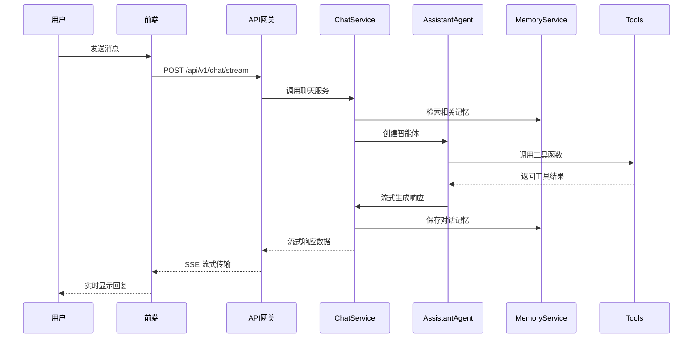
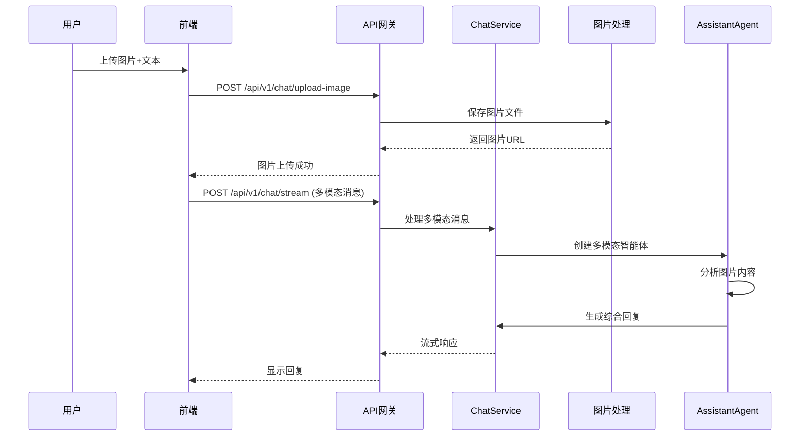

# 智能客服系统总体架构还原提示词

## 架构设计理念

智能客服系统采用现代化的微服务架构设计，基于前后端分离的理念，结合 AutoGen 多智能体框架，构建了一个高可用、可扩展、易维护的智能客服解决方案。

## 系统架构层次

### 1. 表现层 (Presentation Layer)

**技术栈**: Next.js 14 + React 18 + TypeScript

```typescript
// 核心组件结构
CustomerServicePage
├── 聊天界面组件
│   ├── 消息列表渲染
│   ├── 输入框组件
│   ├── 文件上传组件
│   └── 模型选择器
├── 消息处理逻辑
│   ├── 流式响应处理
│   ├── 多模态消息格式化
│   ├── 会话状态管理
│   └── 错误处理机制
└── API 客户端
    ├── 聊天流式请求
    ├── 会话管理请求
    ├── 图片上传请求
    └── 响应数据处理
```

**关键特性**:
- 响应式设计，支持多设备访问
- 实时流式消息显示
- Markdown 渲染支持
- 代码高亮显示
- 图片预览和管理
- 暗色/亮色主题切换

### 2. 应用服务层 (Application Service Layer)

**技术栈**: FastAPI + Python 3.9+

```python
# API 路由结构
/api/v1/chat/
├── /stream          # 流式聊天接口
├── /session/create  # 创建会话
├── /session/{id}    # 获取会话详情
├── /sessions/{uid}  # 获取用户会话列表
├── /upload-image    # 图片上传
└── /images/{uid}/{name}  # 图片访问
```

**服务组件**:
- **ChatService**: 核心聊天服务，处理对话逻辑
- **SessionService**: 会话管理服务，处理会话生命周期
- **MemoryServiceFactory**: 记忆服务工厂，管理不同类型的记忆
- **AgentTools**: 工具函数集合，提供业务功能调用

### 3. 智能体层 (Agent Layer)

**技术栈**: AutoGen AgentChat Framework

```python
# 智能体架构
AssistantAgent
├── 模型客户端 (OpenAI Compatible)
├── 系统提示词配置
├── 工具函数集成
│   ├── get_product_details
│   ├── search_products
│   ├── get_order_status
│   ├── cancel_order
│   ├── get_active_promotions
│   ├── get_policy
│   ├── check_return_eligibility
│   ├── submit_return_request
│   └── log_feedback
├── 记忆系统集成
│   ├── 聊天历史记忆
│   ├── 公共知识库记忆
│   └── 私有知识库记忆
└── 多模态消息处理
    ├── 文本消息处理
    ├── 图片消息处理
    └── 混合消息处理
```

**核心能力**:
- 自然语言理解和生成
- 工具调用和结果处理
- 上下文记忆管理
- 多模态内容理解
- 流式响应生成

### 4. 业务逻辑层 (Business Logic Layer)

**记忆管理系统**:
```python
MemoryServiceFactory
├── ChatMemoryService     # 聊天历史记忆
│   ├── 对话历史存储
│   ├── 上下文检索
│   └── 会话状态管理
├── PrivateMemoryService   # 私有知识库
│   ├── 用户个人知识
│   ├── 向量化存储
│   └── 语义检索
└── PublicMemoryService    # 公共知识库
    ├── 共享知识库
    ├── 政策文档
    └── 常见问题
```

**会话管理系统**:
```python
SessionService
├── 会话创建和销毁
├── 会话状态持久化
├── 用户会话隔离
├── 消息历史管理
└── 会话恢复机制
```

### 5. 数据访问层 (Data Access Layer)

**存储架构**:
```
数据存储层
├── 结构化数据存储
│   ├── SQLite 数据库
│   ├── 会话数据表
│   ├── 用户数据表
│   └── 消息数据表
├── 非结构化数据存储
│   ├── 文件系统存储
│   ├── 图片文件存储
│   ├── 日志文件存储
│   └── 配置文件存储
└── 向量数据存储
    ├── 记忆向量化
    ├── 语义检索索引
    └── 相似度计算
```

## 系统交互流程

### 1. 用户消息处理流程



### 2. 多模态消息处理流程



## 关键设计模式

### 1. 工厂模式 (Factory Pattern)

```python
class MemoryServiceFactory:
    """记忆服务工厂，统一管理不同类型的记忆服务"""
    
    def get_chat_memory_service(self, user_id: str) -> ChatMemoryService:
        """获取聊天记忆服务"""
        
    def get_private_memory_service(self, user_id: str) -> PrivateMemoryService:
        """获取私有记忆服务"""
        
    def get_public_memory_service(self) -> PublicMemoryService:
        """获取公共记忆服务"""
```

### 2. 策略模式 (Strategy Pattern)

```python
class MessageProcessor:
    """消息处理策略"""
    
    async def process_text_message(self, message: str) -> str:
        """处理文本消息"""
        
    async def process_multimodal_message(self, message: MultiModalMessage) -> str:
        """处理多模态消息"""
```

### 3. 观察者模式 (Observer Pattern)

```python
class StreamingResponseHandler:
    """流式响应处理器"""
    
    async def handle_chunk(self, chunk: str):
        """处理响应片段"""
        
    async def handle_complete(self, result: TaskResult):
        """处理完成事件"""
```

## 性能优化策略

### 1. 前端优化
- **代码分割**: 按路由和组件进行代码分割
- **懒加载**: 图片和组件的懒加载
- **缓存策略**: 静态资源和API响应缓存
- **虚拟滚动**: 长消息列表的虚拟滚动

### 2. 后端优化
- **异步处理**: 全异步的请求处理
- **连接池**: 数据库连接池管理
- **缓存机制**: 记忆检索结果缓存
- **流式响应**: 减少首字节时间

### 3. 存储优化
- **索引优化**: 数据库查询索引
- **向量检索**: 高效的语义检索
- **文件压缩**: 图片文件压缩存储
- **清理机制**: 过期数据自动清理

## 安全性设计

### 1. 数据安全
- **用户隔离**: 严格的用户数据隔离
- **输入验证**: 全面的输入参数验证
- **文件安全**: 上传文件类型和大小限制
- **SQL注入防护**: 参数化查询

### 2. 接口安全
- **CORS配置**: 跨域请求控制
- **请求限流**: API请求频率限制
- **错误处理**: 安全的错误信息返回
- **日志记录**: 完整的操作日志

## 可扩展性设计

### 1. 水平扩展
- **无状态设计**: 服务无状态化
- **负载均衡**: 多实例负载分发
- **数据库分片**: 大数据量分片存储
- **缓存集群**: 分布式缓存

### 2. 功能扩展
- **插件机制**: 工具函数插件化
- **模型切换**: 多LLM模型支持
- **多语言**: 国际化框架
- **监控集成**: 系统监控和告警

## 部署架构

### 1. 开发环境
```
开发环境
├── 前端开发服务器 (Next.js Dev Server)
├── 后端开发服务器 (FastAPI Uvicorn)
├── 本地数据库 (SQLite)
└── 本地文件存储
```

### 2. 生产环境
```
生产环境
├── 负载均衡器 (Nginx)
├── 前端静态服务 (CDN)
├── 后端服务集群 (Docker + K8s)
├── 数据库集群 (PostgreSQL)
├── 文件存储服务 (MinIO/S3)
└── 监控告警系统 (Prometheus + Grafana)
```

## 技术债务和改进方向

### 1. 当前限制
- 单机SQLite存储限制
- 文件系统存储的扩展性
- 缺乏用户认证机制
- 监控和日志系统不完善

### 2. 改进计划
- 迁移到分布式数据库
- 实现对象存储集成
- 添加用户认证和授权
- 完善监控和告警系统
- 增加自动化测试覆盖

---

本架构设计确保了系统的高可用性、可扩展性和可维护性，为智能客服系统的长期发展奠定了坚实的技术基础。